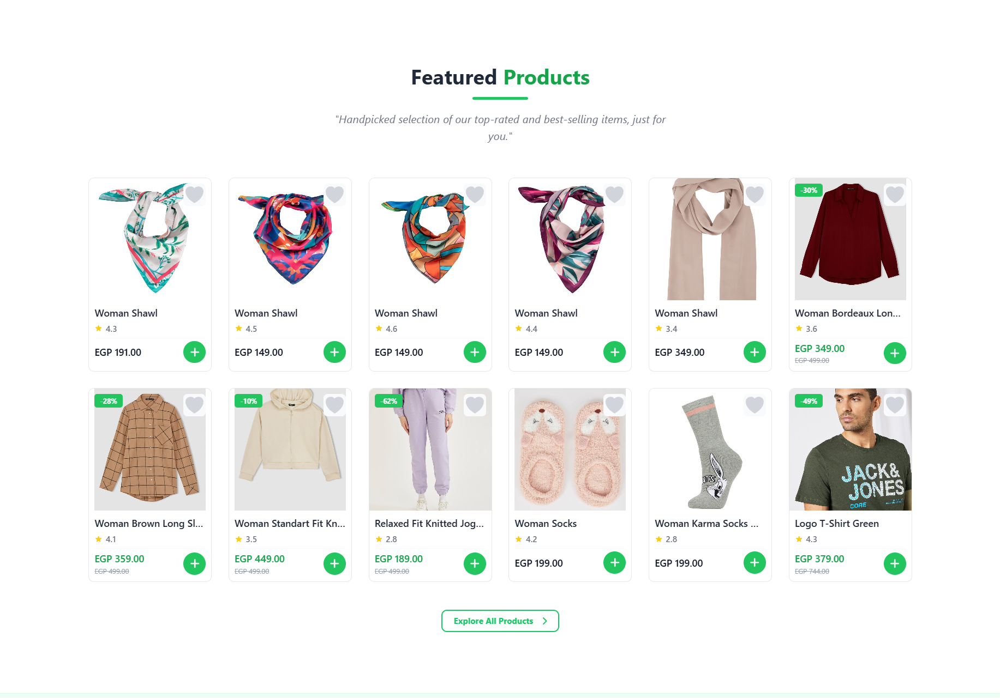
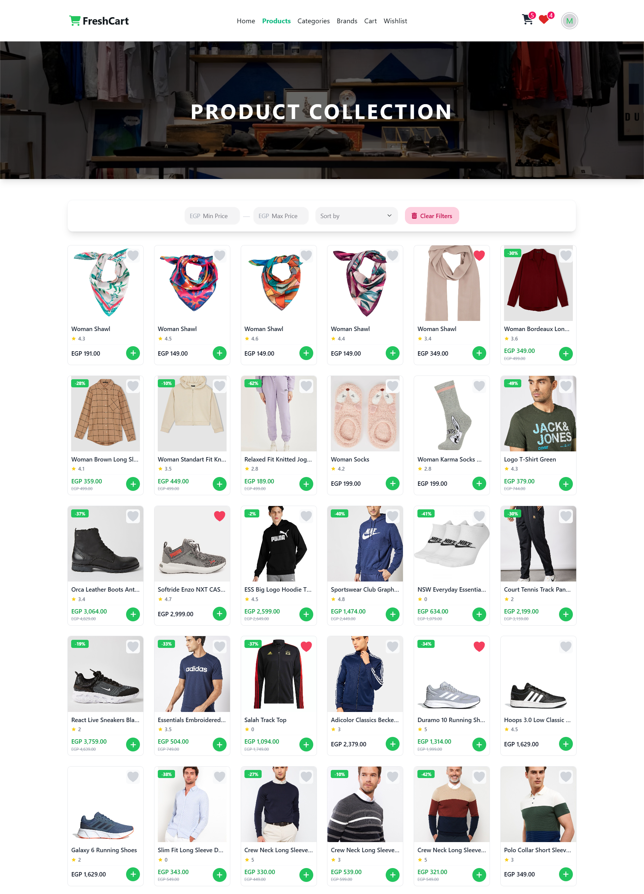
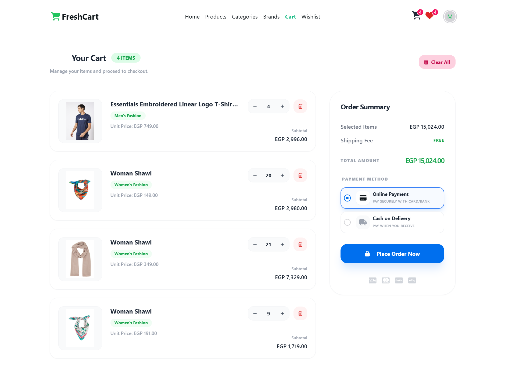

# 🛒 FreshCart E-Commerce

A modern, fast, and fully responsive e-commerce web application built with the latest front-end technologies to deliver a seamless shopping experience.

---

## 🚀 Live Demo

👉 https://mahmood-mohamed.github.io/freshcart/

---

## 📸 Screenshots
## 🖥️ Home Page

## 🛍️ Products

## 🛒 Cart


---

## 📌 Overview

FreshCart is a complete e-commerce platform that allows users to browse products, manage their cart, add items to wishlist, and complete purchases smoothly.

The project focuses on performance, scalability, and clean UI/UX to simulate a real-world shopping experience.

---

## ✨ Features

- 🛒 **Cart Management**  
  Add to cart, update quantities, and manage items easily  

- ❤️ **Wishlist**  
  Save favorite products for later  

- 📦 **Product Details**  
  Detailed product view with all necessary information  

- ⭐ **Reviews UI**  
  Display product ratings and reviews  

- 🔐 **Authentication**  
  Login, Register, and Forget Password functionality  

- 📱 **Responsive Design**  
  Fully optimized for mobile, tablet, and desktop  

- ⚡ **High Performance**  
  Optimized state management for fast experience  

---

## 🚀 Advanced Features

- 🧾 **Order History Page**  
  Track all previous orders with details (products, total price, order status)

- 💳 **Stripe Payment Integration**  
  Secure online payments with Stripe  

- 💵 **Cash on Delivery (COD)**  
  Place orders and pay upon delivery  

- ❓ **FAQ Page**  
  Help users find quick answers easily  

---

## 🧠 Tech Stack

- **Frontend:** React.js  
- **Styling:** Tailwind CSS, HeroUI  
- **State Management:** Redux Toolkit, React Query  
- **API Handling:** RESTful APIs  

---

## ⚙️ Installation & Setup

```bash
# Clone the repository
git clone https://github.com/mahmood-mohamed/freshcart.git

# Navigate to project folder
cd freshcart

# Install dependencies
npm install

# Run development server
npm run dev
```

---

## 📈 Future Improvements

- 🛠️ Admin dashboard  
- 🌍 Multi-language support  
- 📦 Order tracking system  

---

## ⭐ Support

If you like this project, don’t forget to ⭐ the repository!
